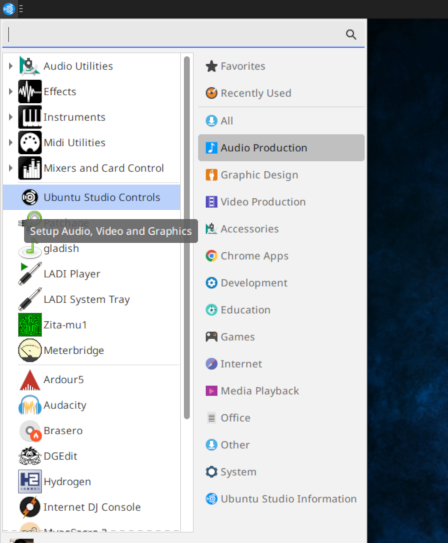
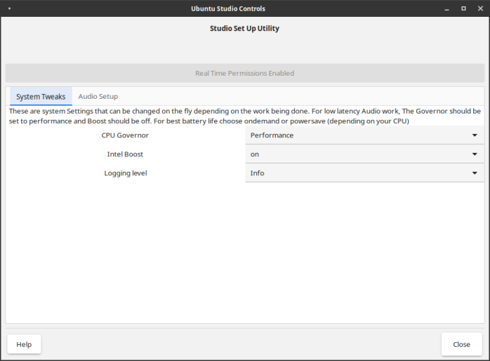
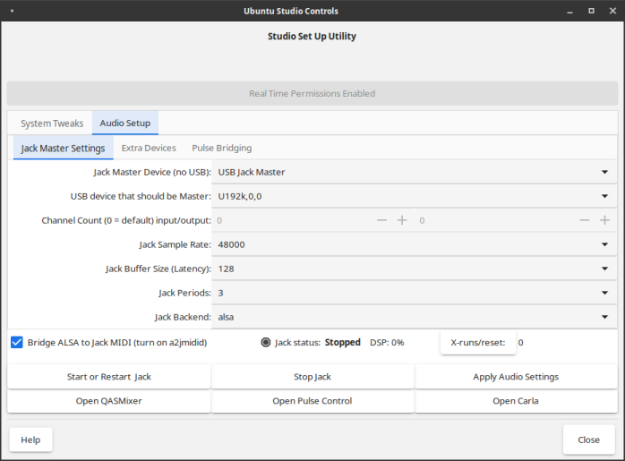
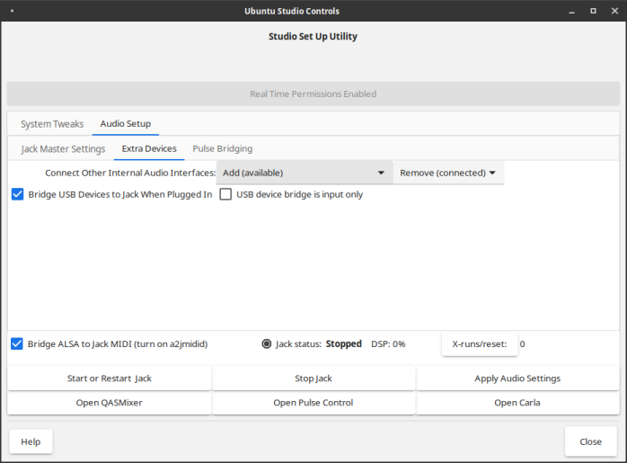
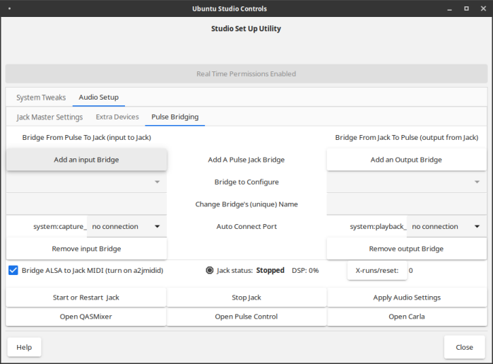

# UbuntuStudio/UbuntuStudioControls - Community Help Wiki

| Home | Ubuntu Studio Controls | Audio Handbook | FAQ | Other Resources and Links |
| --- | --- | --- | --- | --- |

---

# Ubuntu Studio Controls

**This section is for the version of Ubuntu Studio Controls 1.12.6 included with Ubuntu Studio 20.04 LTS and already included in the Ubuntu Studio Backports PPA.**

Ubuntu Studio Controls is the easiest and best way to configure your Ubuntu Studio installation for real-time audio. Ubuntu Studio Controls has several key features that make it unique:

- Adjusts the CPU Governor for higher processing power as required
- Adds the user to the Audio group for real-time permissions if needed
- Gives control over the JACK Audio Connection Kit
- Bridges ALSA MIDI and [PulseAudio](https://help.ubuntu.com/community/PulseAudio) to JACK if needed
- Allows for multiple, custom-named [PulseAudio](https://help.ubuntu.com/community/PulseAudio) Bridges
- **Adds USB Devices to JACK when they are plugged in**
- **Allows multiple audio devices to use JACK at once**
- Persists your configuration between reboots
- Shows the status of JACK
- Settings persist between reboots, including JACK's running state

## Obtaining Ubuntu Studio Controls

Ubuntu Studio Controls is installed in Ubuntu Studio by default. However, the version covered in this page is only part of Ubuntu Studio 20.04 and higher, or any supported Ubuntu Studio version with the backports PPA.

To obtain this newer version, add the **[Ubuntu Studio Backports PPA](UbuntuStudio/UbuntuStudio--BackportsPPA)**.

If you are running a different official flavor of Ubuntu than Ubuntu Studio, Ubuntu Studio Controls installs with the Ubuntu Studio Installer.

If not already installed, open a terminal and type: sudo apt install ubuntustudio-controls

Ubuntu Studio Controls can be found in the Audio Production menu.

## Top of Window

At the top of the window, you will see a button to enable Real Time Permissions for audio. If this button is available, click it, and follow the instructions to log-out and log back in.

## System Tweaks Tab

- **CPU Governor:** Sets the CPU governor. If you are doing low latency audio work, the CPU Governor should be set to Performance
- **Intel Boost:** Sets the Intel Boost to On or Off. Experiment with this setting to see what gives you the best performance/lowest latency without Xruns if doing audio work.
- **Logging level:** Changes how much information is in the logs. Only change this for debugging purposes.

## Audio Setup

This is where the configuration for the JACK Audio Connection Kit (Jack) is done, and shows the status of the JACK audio system

- **Bridge ALSA to Jack MIDI (turn on a2jmidid):** This allows Jack to use external MIDI devices.
- **Jack status:** Shows whether or not the Jack audio server is running, and also displays the amount of Digital Signal Processor (DSP) in use.

The buttons at the bottom of this tab allow you to Start or Restart Jack, Stop Jack (return system audio to default settings), or Apply Audio Settings without restating Jack, if possible.

Additionally, to facilitate routing and audio control, three more buttons are presented to conveniently open other applications for control: **QASMixer** (a graphical control for the ALSA audio backend), **Pulse Control** (PAVUControl, a graphical control for [PulseAudio](https://help.ubuntu.com/community/PulseAudio)), and **Carla** (an audio plugin host/rack and patchbay for Jack).

### Jack Master Settings

- **Jack Master Device (no USB):** This is for selecting which internal audio device should be the master device.
- **USB device that should be Master:** If so desired, this enables you to configure JACK to treat a connected external USB audio device, such as a USB audio interface, to be treated as if it were the internal master audio device, overriding the setting set above.
- **Channel Count (0 = default) input/output:** These settings control how many inputs/outputs Jack is allowed to access for dummy audio devices.
- **Jack Sample Rate:** Set this to the desired sample rate for your master audio device. If you are unsure as to what this setting should be, set it to 44100 or 48000.
- **Jack Buffer Size (Latency):** Set this to the desired buffer for Jack. The higher the buffer, the higher the latency. Finding the best buffer with the lowest latency to prevent Xruns is a matter of to trial-and-error. In most cases, if using the [PulseAudio](https://help.ubuntu.com/community/PulseAudio)-Jack bridge (described below), a higher buffer is required. Additionally, if HDMI is being used, a buffer of 4096 or higher may be required.
- **Jack Periods:** This option sets how many times Jack buffers in a given sample. For USB audio devices, set this to 3. [Click Here](https://wiki.linuxaudio.org/wiki/list_of_jack_frame_period_settings_ideal_for_usb_interface) for a detailed explanation.
- **Jack Backend:** This option sets whether the Jack backend should be the default Linux **ALSA** backend, or a **Dummy** audio device, usually used for experimentation. Most will want to keep this set to "ALSA".

### Extra Devices

- **Connect Other Internal Audio Interfaces:** If you have more than one internal audio device, this will allow you to add or remove those audio devices from being recognized by Jack.
- **Bridge USB Devices to Jack When Plugged In:** This allows USB devices to be "hotpugged" and immediately recognized while Jack is running.
- **USB device bridge is input only:** Some USB audio devices are input-only. This helps facilitate those devices.

### Pulse Bridging

- **Add A Pulse Jack Bridge:** Here you can add an input bridge and/or an output bridge.
- **Bridge to Configure:** This selects which bridge you are configuring for the buttons/fields that follow
- **Change Bridge's (unique) Name:** This allows you to give the selected bridge a unique, customized name
- **Audio Connect Port:** Selects which system ports to which you would like automatically have the bridge connect.

---

[CategoryUbuntuStudio](UbuntuStudio/CategoryUbuntuStudio)
